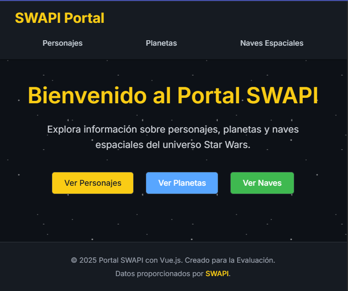

# Portal SWAPI con Vue.js - Segunda Evaluación TWeb

Este proyecto es una plantilla de portal web desarrollada con Vue.js 3 que consume datos de la [API pública SWAPI (Star Wars API)](https://www.swapi.tech/) para mostrar información sobre personajes, planetas y naves espaciales del universo Star Wars.

## Características

* **Framework:** Vue.js 3 (Composition API con `<script setup>`)
* **Enrutamiento:** Vue Router para la navegación entre vistas (Inicio, Personajes, Planetas, Naves).
* **Estilos:** CSS Puro con Flexbox/Grid para un diseño responsive y atractivo. Se utilizan variables CSS para facilitar la personalización.
* **Peticiones HTTP:** API Fetch nativa para consumir la SWAPI.
* **Componentes Reutilizables:** Navbar, Footer, DataCard, LoadingSpinner, ErrorMessage.
* **Manejo de Estado:** `ref` de Vue para el estado local de los componentes (carga, error, datos).
* **Paginación:** Navegación básica entre páginas de resultados de la API.
* **Manejo de Carga y Errores:** Indicadores visuales durante la carga de datos y mensajes claros en caso de error.

## Estructura del Proyecto

├── public/             # Archivos estáticos públicos

├── src/
 
  │   ├── assets/         # Archivos CSS (main.css, view-styles.css), imágenes, etc.
 
  │   ├── components/     # Componentes Vue reutilizables

  │   ├── composables/    # Lógica reutilizable (useSwapiData.js)
 
  │   ├── router/         # Configuración de Vue Router (index.js)
 
  │   ├── views/          # Componentes Vue que representan páginas/vistas (HomeView.vue, 
                            PlanetsView.vue, StarshipsView.vue)
 
  │   ├── App.vue         # Componente raíz de la aplicación
 
  │   └── main.js         # Punto de entrada de la aplicación
 
  ├── .gitignore          # Archivos ignorados por Git
 
  ├── index.html          # Plantilla HTML principal
 
  ├── package.json        # Dependencias y scripts del proyecto
 
  └── README.md           # Este archivo

## API Consumida

Se utilizan los siguientes endpoints de la SWAPI a través del composable `useSwapiData`:

* `https://www.swapi.tech/api/people/` - Para obtener datos de personajes.
* `https://www.swapi.tech/api/planets/` - Para obtener datos de planetas.
* `https://www.swapi.tech/api/starships/` - Para obtener datos de naves espaciales.

## Instalación y Uso

**Requisitos Previos:**

* Node.js y npm (o yarn) instalados. [Descargar Node.js](https://nodejs.org/)

**Pasos:**

1.  **Clonar el repositorio:**
    ```bash
    git clone https://github.com/Esme0123/EsmeraldaMedina_2daEvaluacionTWeb.git 
    cd proyectoVue
    ```

2.  **Instalar dependencias:**
    ```bash
    npm install
    ```

3.  **Ejecutar el servidor de desarrollo:**
    ```bash
    npm run dev
    ```
    La aplicación estará disponible en `http://localhost:5173` 

## Explicación Técnica

* **`main.js`**: Inicializa la aplicación Vue, importa los estilos globales (`main.css`) y monta el componente raíz `App.vue` utilizando el router.
* **`router/index.js`**: Define las rutas y las asocia con sus componentes de vista.
* **`App.vue`**: Layout principal con `Navbar`, `Footer` y `<router-view>`.
* **`src/composables/useSwapiData.js`**: **(Clave)** Función composable que recibe el nombre del recurso SWAPI ('people', 'planets', etc.). Maneja internamente el estado reactivo (`items`, `loading`, `error`, `nextPage`, `previousPage`, `totalCount`), realiza las llamadas `fetch`, gestiona errores y expone el estado (principalmente como `readonly`) y la función `fetchData` para ser utilizada por las vistas. También incluye una función para calcular la página actual.
* **Componentes (`src/components/`)**:
    * Cada componente tiene estilos definidos en su bloque `<style scoped>`.
    * `DataCard.vue`: Muestra datos en formato de tarjeta estilizada.
    * `LoadingIndicator.vue`: Animación de "escáner" más elaborada. Reempla
    * `Navbar.vue`, `Footer.vue`, `ErrorMessage.vue`: Componentes reutilizables para la estructura y UI.
* **Vistas (`src/views/`)**:
    * Importan y utilizan `useSwapiData('nombre_recurso')` para obtener el estado reactivo (`items`, `loading`, etc.) y la función `fetchData`.
    * Llaman a `fetchData()` en `onMounted` para la carga inicial.
    * El template muestra condicionalmente `LoadingIndicator`, `ErrorMessage` o el `card-grid` con `DataCard`s, basándose en el estado proporcionado por el composable.
    * Implementan la paginación llamando a `fetchData(previousPage.value)` o `fetchData(nextPage.value)`.
    * Muestran el número de página actual usando `currentPage` del composable.
    * Importan `view-styles.css` y definen colores temáticos específicos en `<style scoped>`.
* **CSS**:
    * `src/assets/main.css`: Contiene estilos globales, reseteo básico, variables CSS (--color-background, --color-primary, etc.) y estilos base para elementos como `body`, `a`, `button`.
    * `src/assets/view-styles.css`: Define estilos comunes para las vistas, como la estructura de la cuadrícula (`card-grid`) y los controles de paginación (`pagination-controls`).
    * `<style scoped>` en cada componente: Contiene estilos específicos para ese componente, asegurando que no afecten a otros. Se usa Flexbox y Grid para layouts responsivos.

## Capturas de pantalla del portal Web
Se usaron los colores respecto a los colores que usa Swapi
* **Inicio**
  

  Versión Desktop
  
  

  Versión Tablet
  
  

  Versión Celular

  Está es la página principal del portal donde podemos ver un menú en la parte de arriba del nombre SWAPI Portal en el cual si se hace click te lleva al inicio, es decir, en la página que nos encontramos actualmente. También podemos ver las tres opciones Personajes  Planetas   Naves Espaciales, de las cuales si hacemos click veremos cada sección. Por otro lado, en el medio tenemos un mensaje de bienvenida hacia el portal y un breve mensaje que explica las opciones que se pueden explorar sobre Star Wars. Cada botón con su respectivo color. Por último, podemos ver el Footer donde nos describe que hicimos el portal con Vue.js y los datos proporcionados por Swapi, que si hacemos click en Swapi nos lleva a la página web del mismo. Como vemos según cada tipo de pantalla estos componentes se van adaptando para un buen entendimiento de cada sección del Inicio. Con un fondo estrellado haciendo referencia a la película de Star Wars.

  Cabe resaltar que cada botón o componente del navbar, tiene un diferente color si se pasa el ratón encima, es decir, se aplicó estilos para lograr este resultado y que quede más estético.

* **Personajes**
  

  Versión Desktop

  

  Versión Tablet

  
  
  Versión Celular

  Está es la página de PERSONAJES donde tenemos los distintos personajes 10 por página y al estar seleccionado PERSONAJES del navbar cambia de color. En total son 9 páginas y ya no te permite dar click a siguiente.

  

  Como podemos observar el loading tiene un mensaje de "Buscando datos en la galaxia..." esto es aplicado cada vez que alguien quiera cambiar la página tanto en Personajes, Planetas y Naves Espaciales.

* **Planetas**
  

  Versión Desktop

  

  Versión Tablet

   
  
  Versión Celular

  Está es la página de Planetas donde tenemos la misma estructura que en Personajes. De un color que representa los planetas junto al ícono. En total tenemos 6 páginas cada una de 10 planetas, a excepción de la última página que tiene 6 planetas. 

* **Naves Espaciales**  
  

  Versión Desktop

  

  Versión Tablet

  

  Versión Celular

  Está es la página de Naves Espaciales que cuenta con 4 páginas cada una de 10 naves espaciales, a excepción de la última que solo cuenta con 6 naves espaciales. El color que lo representa es el verde junto con un ícono.


